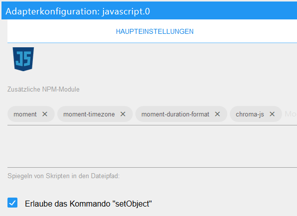

# Wetter Beispiel Projekt für Material Design Widgets

Ein Beispiel Projekt für eine responsiv VIS View mit Wetter Daten.

 

### Voraussetzungen

###### Folgende Adapter werden benötigt:
* [Material Design Widgets](https://github.com/Scrounger/ioBroker.vis-materialdesign) >= 0.3.0
* [DasWetter](https://github.com/rg-engineering/ioBroker.daswetter) >= 2.8.1
* [weatherunderground](https://github.com/iobroker-community-adapters/ioBroker.weatherunderground) >= 3.2.1
* [Pollenflug](https://github.com/schmupu/ioBroker.pollenflug) >= 1.0.4
* [Javascript ](https://github.com/ioBroker/ioBroker.javascript) >= 4.0.0

###### Folgende NPM Module und Einstellung im Javascript Adapter:
* moment
* moment-timezone
* moment-duration-format
* chroma-js
* Einstellung `Erlaub das Kommando "setObject"` muss aktiviert sein

### Installation

1. [Skript herunterladen](DasWetter.js) und unter Skripte anlegen
2. zweimal das Skript ausführen. Beim ersten Mal werden die Datenpunkte angelegt, beim zweiten Mal die Werte erzeugt.
3. [Beispielprojekt](Material-Design-Widgest_Weather.zip) in VIS importieren

### Links
* [Thema im ioBroker Forum]()

### Vielen Dank an
* [sigi234](https://forum.iobroker.net/user/sigi234): für die Insperation, als Basis hab ich mich an [seinem Wetter Projekt](https://forum.iobroker.net/topic/20675/projekt-wetterview-von-sigi234) orientiert
* [Mic](https://forum.iobroker.net/user/mic): für sein Skript um Datenpunkte unter `0_userdata.0` zu ereugen. [Das Skript findet ihr hier](https://github.com/Mic-M/iobroker.createUserStates)

### Changelog

### 1.0.0 (13.04.2020)
* (Scrounger) intial release